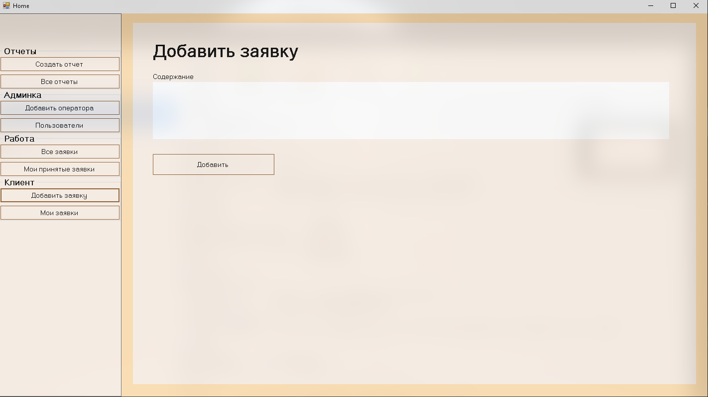
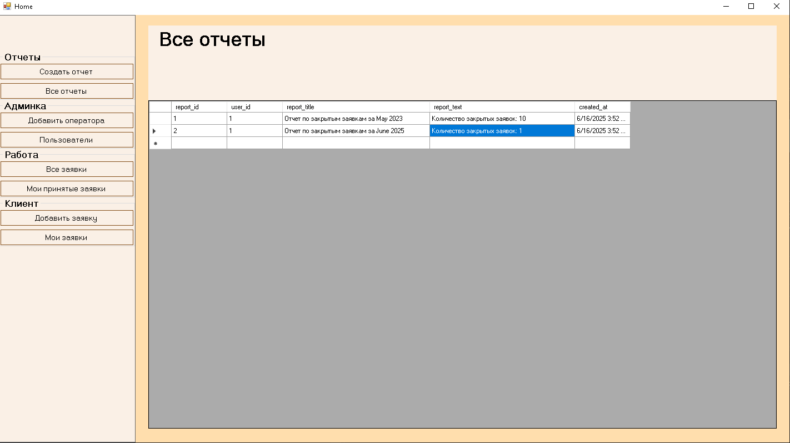
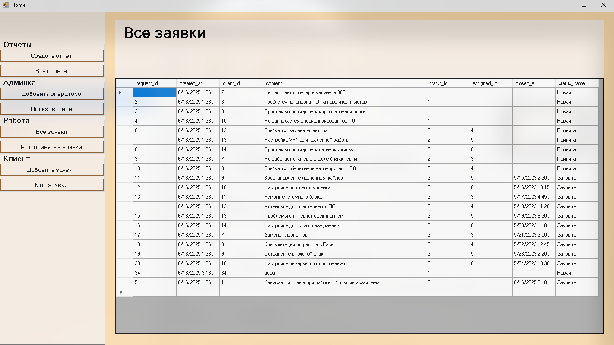
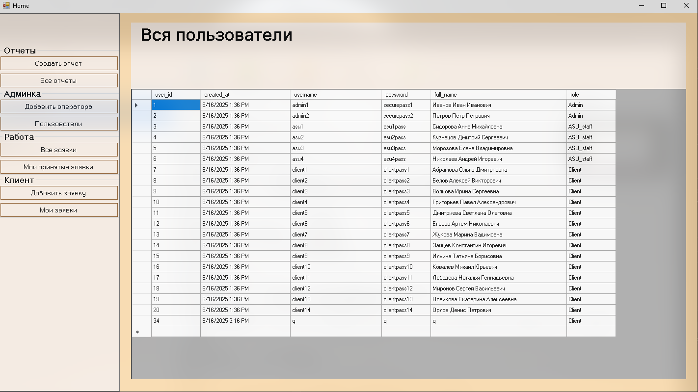

# Разработка базы данных для учета работы отдела АСУ в ГБУЗ «Лабинская центральная районная больница» МЗ КК

Проект является Alpha версией дипломного проекта [CSWT-CSharp](https://github.com/KaliShau/CSWT-CSharp)

## Описание проекта

Данный проект представляет собой разработку базы данных для автоматизации учета работы отдела автоматизированных систем управления (АСУ) в ГБУЗ «Лабинская центральная районная больница» МЗ КК. Основная цель проекта — создание эффективной и надежной системы, которая позволит автоматизировать процессы учета, управления и анализа данных, связанных с деятельностью отдела АСУ.

### Основные функции системы:

- Учет пользователей (администраторы, сотрудники отдела АСУ, клиенты).
- Управление заявками (создание, обновление, закрытие).
- Генерация отчетов о выполненных заявках.
- Централизованное хранение данных о работе отдела АСУ.

## Технологии и инструменты

- **Язык программирования**: C#
- **Среда разработки**: Visual Studio Community
- **Система управления базами данных (СУБД)**: PostgreSQL
- **Библиотека для работы с БД**: Npgsql (ADO.NET для PostgreSQL)
- **Диаграммы и модели**: ER-диаграммы, UML

## Структура базы данных

База данных состоит из следующих таблиц:

1. **Users** — информация о пользователях системы (администраторы, сотрудники отдела АСУ, клиенты).
2. **Statuses** — возможные статусы заявок (например, "Новая", "В работе", "Завершена").
3. **Requests** — заявки, создаваемые клиентами, с указанием статуса и назначенного сотрудника.
4. **Reports** — отчеты, генерируемые системой на основе выполненных заявок.

### Связи между таблицами:

- Таблица **Requests** связана с таблицей **Users** через внешний ключ `client_id`, который указывает на пользователя, создавшего заявку.
- Таблица **Requests** также связана с таблицей **Statuses** через внешний ключ `status_id`, который указывает на текущий статус заявки.
- Таблица **Reports** связана с таблицей **Users** через внешний ключ `user_id`, который указывает на пользователя, создавшего отчет.

## Установка и запуск

### Требования:

- Установленная СУБД PostgreSQL.
- Установленная среда разработки Visual Studio Community.
- Библиотека Npgsql для работы с PostgreSQL.

### Шаги для запуска:

1. Клонируйте репозиторий:
2. Откройте проект в Visual Studio.
3. Настройте подключение к базе данных PostgreSQL, указав параметры в файле конфигурации.
4. Запустите проект через Visual Studio.

## Руководство пользователя

1. **Вход в систему**:
   - Перейдите на форму входа и введите логин и пароль.
   - Нажмите кнопку «Вход».
2. **Создание заявки**:
   - Перейдите на форму создания заявки, введите описание заявки и нажмите «Добавить».
3. **Управление заявками**:
   - На форме управления заявками вы можете просматривать, обновлять и закрывать заявки.
4. **Генерация отчетов**:
   - Перейдите на форму генерации отчетов, выберите тип отчета и нажмите «Сгенерировать».
5. **Просмотр отчетов**:
   - На форме просмотра отчетов вы можете просмотреть все сгенерированные отчеты.
6. **Выход из системы**:
   - Нажмите кнопку «Выход» для завершения работы с системой.

## Заключение

Разработанная база данных и интерфейс представляют собой эффективное решение для автоматизации учета работы отдела АСУ в медицинском учреждении. Это позволит повысить производительность труда сотрудников, улучшить качество предоставляемых услуг и обеспечить более эффективное использование ресурсов учреждения.

## Список использованных источников

1. Алексеев, Д. В. Современные СУБД: сравнительный анализ MySQL и PostgreSQL // Программирование и базы данных. -- 2021. -- № 5. -- С. 40-48.
2. Белов, Е. А. Нормализация баз данных: теория и практика. -- М.: Бином, 2022. -- 180 с.
3. Гаврилов, А. В. Современные подходы к автоматизации медицинских учреждений // Информационные технологии в здравоохранении. -- 2021. -- № 3. -- С. 45-52.
4. PostgreSQL Documentation. [Ссылка](https://www.postgresql.org/docs/)
5. Visual Studio Documentation. [Ссылка](https://docs.microsoft.com/ru-ru/visualstudio/)

## Картинки

---

**Автор**: Федоренко Андрей Юрьевич  
**Руководитель**: Ефентьева Ирина Петровна  
**Год**: 2025  
**Организация**: ГАПОУ КК ЛАТ, Лабинск
